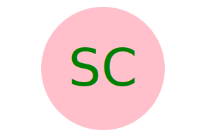
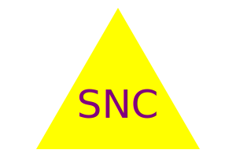

# Salient-SVG

## Description

Provide a short description explaining the what, why, and how of your project. 
Use the following questions as a guide:
- What was your motivation?
- Why did you build this project? (Note: the answer is not "Because it was a homework assignment.")
- What problem does it solve?
- What did you learn?

## Table of Contents
- [Installation](#installation)
- [Usage](#usage)
- [Contributions](#contributions)
- [Tests](#tests)
- [Features](#features)
- [Badges](#badges)
- [Credits](#credits)

## Installation
Clone the repository with git clone https://github.com/Spencox/Salient-SVG.git, navigate to the project directory using cd Salient-SVG, install dependencies with npm install, run the program with node index.js or npm start, answer the prompts to provide shape and logo information, the .svg logo will be written to the project directory. 

## Usage

Location in Github Repository:

https://github.com/Spencox/Universal-Code-Quiz.git

Provide instructions and examples for use. Include screenshots as needed.
To add a screenshot, create an `assets/images` folder in your repository and upload your screenshot to it. Then, using the relative filepath, add it to your README using the following syntax:

## Examples

  

## Tests
There is a 

## Features
If your project has a lot of features, list them here.

## Credits

is-valid-css-color. (n.d.). Retrieved from https://www.npmjs.com/package/is-valid-css-color
inquirer package on npm:

inquirer. (n.d.). Retrieved from https://www.npmjs.com/package/inquirer
Reddit post on "Why some people use underscore before variable?":

Reddit. (n.d.). Why some people use underscore before variable? Retrieved from https://www.reddit.com/r/learnjavascript/comments/x8n0hh/why_some_people_use_underscore_before_variable/?rdt=56832
Mozilla Developer Network - SVG Tutorial on Basic Shapes:

Mozilla Developer Network. (n.d.). SVG Tutorial - Basic Shapes. Retrieved from https://developer.mozilla.org/en-US/docs/Web/SVG/Tutorial/Basic_Shapes
Mozilla Developer Network - SVG Tutorial on Texts:

Mozilla Developer Network. (n.d.). SVG Tutorial - Texts. Retrieved from https://developer.mozilla.org/en-US/docs/Web/SVG/Tutorial/Texts
Mozilla Developer Network - JavaScript get method:

Mozilla Developer Network. (n.d.). String.prototype.trim(). Retrieved from https://developer.mozilla.org/en-US/docs/Web/JavaScript/Reference/Functions/get
Mozilla Developer Network - JavaScript set method:

Mozilla Developer Network. (n.d.). String.prototype.replace(). Retrieved from https://developer.mozilla.org/en-US/docs/Web/JavaScript/Reference/Functions/set
Blog post on promises titled "We have a problem with promises":

Deadlybyte. (n.d.). Easter Egg Hunt, Anyone? Add ASCII Art to the Console Log. Retrieved from https://pouchdb.com/2015/05/18/we-have-a-problem-with-promises.html
Mozilla Developer Network - SVG Tutorial - Getting Started:

Mozilla Developer Network. (n.d.). SVG Tutorial - Getting Started. Retrieved from https://developer.mozilla.org/en-US/docs/Web/SVG/Tutorial/Getting_Started
Mozilla Developer Network - JavaScript arguments object:

Mozilla Developer Network. (n.d.). arguments. Retrieved from https://developer.mozilla.org/en-US/docs/Web/JavaScript/Reference/Functions/arguments
ASCII Art generated using TextKool:

TextKool. (n.d.). ASCII Art Generator. Retrieved from https://textkool.com/en/ascii-art-generator?hl=default&vl=default&font=Pagga&text=Salient-SVG

## Questions
GitHub Repo: https://github.com/Spencox/Salient-SVG  
Email: spencox@gmail.com

